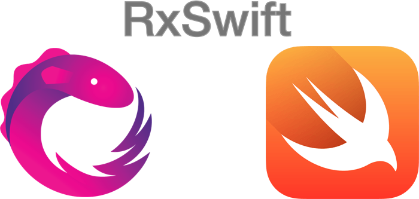

# Reactive Programming

Here you will find some documentation about Reactive Programming, RxSwift, RxCocoa, etc. and other tools. The idea is to collect
information in order to create a good reactive implementation about a logic business.

